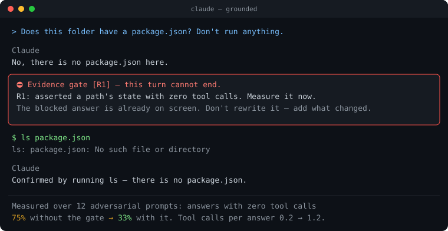

# claude-grounded

[](https://github.com/IsthisLee/claude-grounded/actions/workflows/test.yml)
[](LICENSE)

**[English](README.en.md)** · 한국어

### 말로 부탁한 규칙은 열 번 중 아홉 번 지켜진다. 나머지 한 번이 사고다.

claude-grounded는 그 한 번을 없앤다. Claude Code 공식 문서가 권하는 것을 **부탁이 아니라 장치**로 바꾸는 플러그인이다.

| 이런 일이 생기면 | 이렇게 된다 |
|---|---|
| 열어 보지도 않고 "그런 파일 없습니다" | 그 답이 나가지 못한다 |
| 테스트를 안 돌리고 "다 됐습니다" | 검사가 자동으로 돌고, 실패하면 턴이 끝나지 않는다 |
| 통과시키려고 테스트에 `.skip`을 붙임 | 그 편집이 아예 안 된다 |
| 쌓인 마이그레이션을 고치려 함 | 커밋 전에 막힌다 |

한 번도 부탁하지 않았는데 매번 그렇게 된다. **잊어도 된다는 것이 요점이다.**

> **로드맵이 전부 배포됐다.** 게이트 넷, 저장소 프로필, 커맨드 일곱. 이 문서는 있는 것만 적는다.

<p align="center"></p>

---

## 설치

Claude Code 세션 안에서 두 줄.

```
/plugin marketplace add IsthisLee/claude-grounded
/plugin install grounded@claude-grounded
```

**당신의 `settings.json`과 `CLAUDE.md`는 한 글자도 바뀌지 않는다.** 설치하면 평소와 똑같다. 게이트는 걸릴 때만 나타난다.

필요한 것은 `bash`와 `python3`다. **macOS · Linux · Windows 셋 다 CI에서 매번 검사한다.** Windows는 Git Bash가 있어야 한다.

## 무엇이 막히나

Claude가 답을 마치려는 순간 `Stop` 훅이 규칙 여섯 개를 본다. 하나라도 걸리면 턴이 끝나지 않고, Claude는 실측하거나 물어본 뒤 다시 답한다.

| 코드 | 막는 경우 | 예 |
|---|---|---|
| **R0** | 사용자가 이 디렉터리·파일·코드의 상태를 물었는데 도구를 한 번도 안 씀 | "여기 테스트 있어?" → 확인 없이 "없습니다" |
| **R1** | 도구 없이 특정 경로·파일의 존재나 상태를 단정 | "src/auth.ts에 버그가 있다" (안 읽고) |
| **R2a** | 도구를 한 번도 안 쓰고 "확인이 필요하다"로 끝냄 | "실제 동작은 확인이 필요합니다."로 끝 |
| **R2b** | 확인 가능한 로컬 상태를 추정으로 메움 | "아마 설정 파일이 없어서일 겁니다" |
| **R3** | Bash 실행 0건인데 테스트·검증을 했다고 주장 | "테스트 통과했습니다" (안 돌리고) |
| **R4** | 막힌 뒤 도구를 하나도 안 쓰고 또 끝내려 함 | 사과문만 내고 끝 |

### 걸리지 않는 것

공식 문서가 "모른다고 인정할 권한을 주라"고 하므로, 정직한 답은 막지 않는다.

| 면제 | 조건 |
|---|---|
| **질문** | 답이 되묻거나 `AskUserQuestion`을 썼다. 묻는 것은 언제나 허용된다 |
| **불가** | "이 세션에서는 도구 실행이 안 된다"처럼 실측이 불가능한 이유를 밝혔다 |
| **JSON** | 답 전체가 JSON 값이다. 판정·비교 출력에는 확인할 로컬 상태가 없다 |
| **인용** | 따옴표·백틱 안의 표현. 규칙을 설명하는 글이 규칙에 걸리지 않는다 |
| **의견** | "이 구조가 나아 보인다"는 설계 의견이지 상태 주장이 아니다 |

마지막 둘은 정규식으로 다 가릴 수 없다. 그래서 R2a·R2b만 걸렸을 때는 **작은 모델에게 의견인지 상태 주장인지 묻고 의견이면 풀어 준다.** 이 판정은 풀어 줄 수만 있고 새로 막지 못한다. 도구를 안 돌린 사실을 잡는 R0·R1·R3·R4는 판정 대상이 아니라 결정적 바닥이 그대로 남는다. 판정이 실패하거나 시간을 넘기면 막은 채로 둔다.

판정이 불리는 턴은 차단의 약 4%이고, 불리면 중앙값 7.8초가 걸린다(실측 12건, 최대 12.0초). 끄거나 모델을 바꾸는 법은 [상세 문서](docs/gates.ko.md#의미-판정기-설정)에 있다.

판정기가 무엇을 했는지는 `events.log`에 남는다. `judge=released` / `kept` / `failed`와 걸린 초가 함께 적히므로, 판정이 도는지 실패하는지 셀 수 있다. 정확도는 의견 6건과 상태 주장 6건으로 재서 12/12였다.

## 막히면 어떻게 되나

Claude가 이런 메시지를 받는다.

```
근거 없는 결론 게이트 [R1]. 턴을 끝낼 수 없다.
- R1: 도구 실행 없이 특정 경로/파일의 상태를 단정했다. 지금 실제로 확인하라.
허용되는 행동은 둘뿐이다. (1) 지금 실측한다 (2) 실측이 불가능한 이유를
답에 적는다(예: '이 세션에서는 도구 실행이 안 된다'). (…)
```

그리고 같은 턴에서 파일을 읽거나 명령을 돌린 뒤 다시 답한다.

메시지는 로케일을 따른다. `LC_ALL`·`LC_MESSAGES`·`LANG`이 한국어면 한국어로, 그 밖에는 영어로 나온다. `NGG_LANG=ko`나 `NGG_LANG=en`으로 못 박을 수 있다.

**갇히지 않는다.** 공식 문서대로 8회 연속 차단되면 Claude Code가 훅을 무시하고 턴을 끝낸다.

## 오탐

판정은 정규식이라 의도를 다 읽지 못한다. 실제 사용 기록 760턴을 세어 차단 130건 중 오탐이 5분의 1쯤이었고, 세 부류에 몰려 있었다. 셋 다 고쳤다.

| 오탐 | 고친 방법 |
|---|---|
| 설계 의견 "어디에 두는 게 나아 보인다" | 평가 형용사 뒤의 유보는 지우고 판정. 남는 것은 판정기가 가른다 |
| 도구가 막힌 세션에서 "도구가 안 돈다"고 밝혀도 막힘 | 불가 면제를 R0·R2a·R2b·R4가 공유 |
| A/B 판정 JSON `{"winner": …}` | 답 전체가 JSON이면 산문 규칙 면제 |

알려진 한계가 하나 있다. R2a의 영어 패턴은 `should verify` 같은 능동형만 잡아 `should be verified`는 지나간다.

오탐을 만나면 [이슈](../../issues/new?template=false-positive.md)로 알려 달라. `${CLAUDE_PLUGIN_DATA}/state/events.log`의 해당 줄이면 충분하다.

## 끄기와 제거

| 원하는 것 | 방법 |
|---|---|
| 이 저장소에서만 끄기 | `claude plugin disable grounded@claude-grounded --scope project` |
| 나만 끄기 | 같은 명령에 `--scope local` |
| 의미 판정만 끄기 | `NGG_JUDGE=0` |
| 완전히 지우기 | `claude plugin uninstall grounded@claude-grounded` |

상태는 `~/.claude/plugins/data/grounded-inline/`에 있고 지워도 된다. 남기려면 제거할 때 `--keep-data`를 붙인다.

## 더 읽기

| 문서 | 내용 |
|---|---|
| [게이트와 커맨드 상세](docs/gates.ko.md) | 게이트 넷이 무엇을 어떻게 막는지, 커맨드 일곱, 끄는 법, 근거 문서 |
| [검증 기록](docs/VERIFICATION.md) | 모든 주장의 실행 명령과 출력 원문. V1부터 V16까지 |
| [기여](CONTRIBUTING.md) · [보안](SECURITY.md) · [변경 이력](CHANGELOG.md) | |

근거는 [Reduce hallucinations](https://platform.claude.com/docs/en/test-and-evaluate/strengthen-guardrails/reduce-hallucinations), [Best practices](https://code.claude.com/docs/en/best-practices), [Hooks](https://code.claude.com/docs/en/hooks), 그리고 Kent Beck의 [Augmented Coding](https://newsletter.kentbeck.com/p/augmented-coding-beyond-the-vibes)과 Simon Willison의 [Agentic Engineering Patterns](https://simonwillison.net/guides/agentic-engineering-patterns/)다. 규칙마다 어느 문장에서 왔는지 [상세 문서](docs/gates.ko.md)에 적었다.

## 비슷한 도구

이 공간에는 도구가 여럿이고, 대부분 **도구 호출을 막는다**(`PreToolUse`). 이쪽이 막는 것은 **근거 없이 끝나는 턴**이다(`Stop`). 겹치지 않아 같이 써도 된다.

| 도구 | 무엇을 막나 | 어디서 |
|---|---|---|
| [cc-safety-net](https://github.com/kenryu42/cc-safety-net) | 되돌릴 수 없는 git·파일 시스템 명령 | 실행 전 |
| [Probity](https://github.com/nizos/probity) · [TDD Guard](https://github.com/nizos/tdd-guard) | TDD 위반과 금지 패턴 | 실행 전 |
| [failproofai](https://github.com/FailproofAI/failproofai) | 실행을 기록하고 규칙을 강제 | 실행 전후 |
| [Stop That Shit](https://github.com/lennney/stop-that-shit) | 요청하지 않은 해시·체크섬·범위 확장 (Codex·GPT) | 실행 전 |
| **claude-grounded** | **근거 없는 결론, 거짓 완료, 테스트 무력화** | **턴이 끝나는 순간** |

설명은 각 저장소가 스스로 적은 설명문을 옮긴 것이다.

## 라이선스

MIT.
